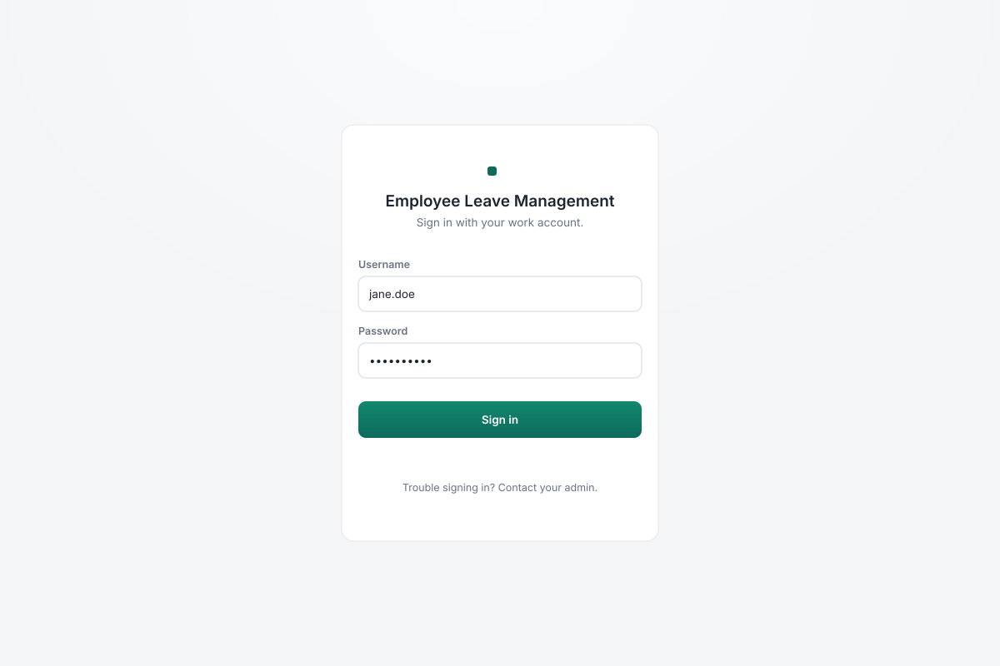
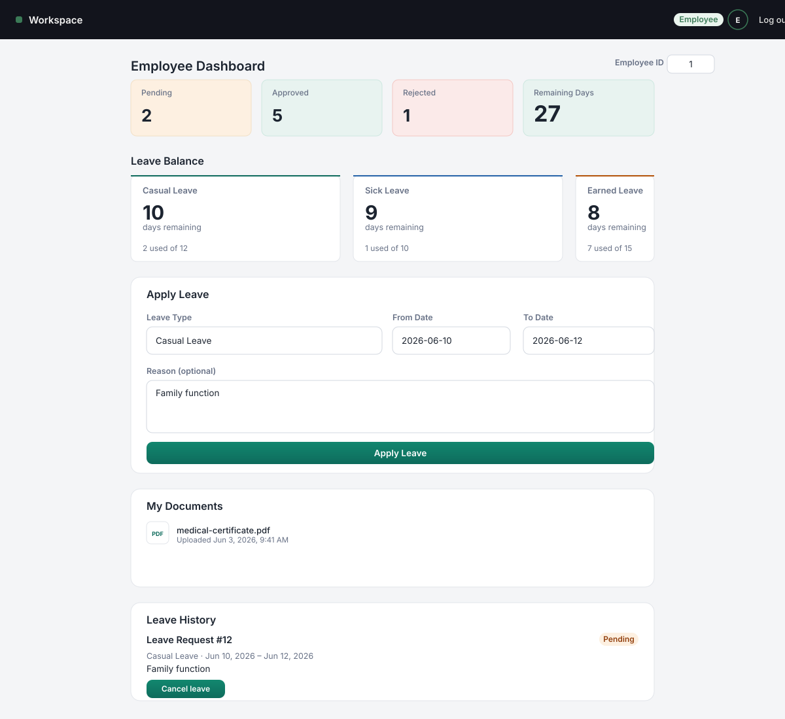
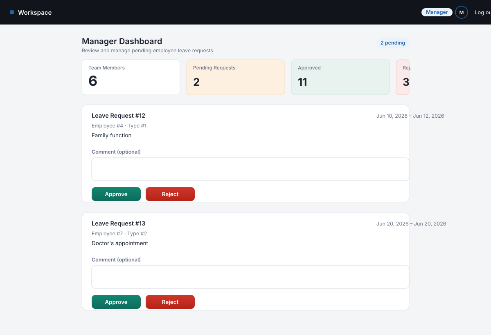
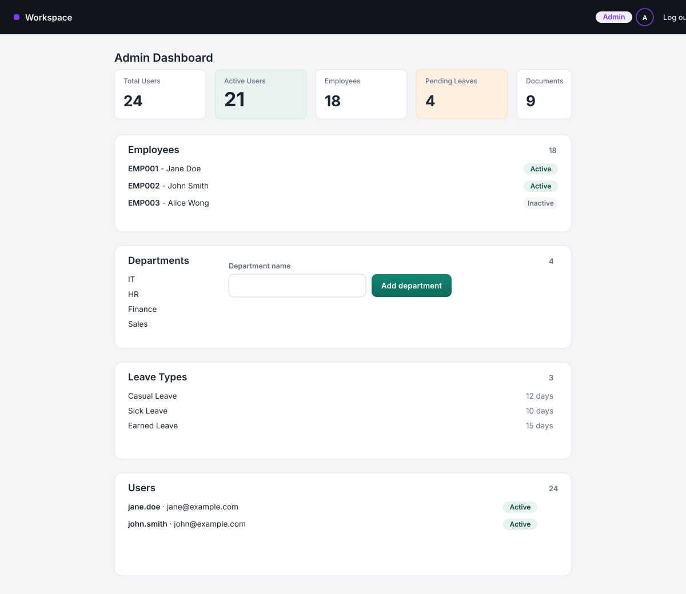

# Employee Leave Management System

A full-stack leave management application with role-based dashboards for
**Employees**, **Managers**, and **Admins**. Employees apply for leave, upload
supporting documents, and track their balances; managers approve or reject
their team's requests; admins manage departments, leave types, users, and
employees.

| Layer     | Technology |
| --------- | ---------- |
| Frontend  | React 19, Vite, vanilla CSS |
| Backend   | FastAPI, SQLAlchemy, Pydantic |
| Database  | PostgreSQL |
| Auth      | JWT (HTTP Bearer), bcrypt password hashing |
| Storage   | Amazon S3 (document uploads) |

---

## Features

- **Authentication** — register/login, JWT access tokens, role-based access
  control (`EMPLOYEE`, `MANAGER`, `ADMIN`).
- **Employee dashboard** — leave balances, apply for leave, view history,
  cancel pending requests, upload and download supporting documents.
- **Manager dashboard** — review, approve, or reject their team's pending
  leave requests with an optional comment.
- **Admin dashboard** — manage departments, leave types, users, and view all
  employees.
- **Leave balance enforcement** — approval validates the requested days
  against the employee's remaining balance.
- **Document management** — S3-backed uploads with signed download URLs.

---

## Screenshots

| Login | Employee dashboard |
| ----- | ------------------ |
|  |  |

| Manager dashboard | Admin dashboard |
| ----------------- | --------------- |
|  |  |

> Screenshots are stored as SVG UI references under `docs/screenshots/`. To
> capture live screenshots, run both the backend and frontend locally and use
> your browser's dev tools.

---

## Repository structure

```
.
├── backend/               FastAPI application
│   ├── app/
│   │   ├── auth/          JWT + password hashing + role dependencies
│   │   ├── models/        SQLAlchemy ORM models
│   │   ├── routers/       API route handlers
│   │   ├── schemas/       Pydantic request/response models
│   │   └── database.py    Engine + session setup
│   ├── create_tables.py   Standalone table-creation script
│   └── requirements.txt
├── database/
│   └── schema.sql         Raw SQL schema + seed data
├── docs/
│   └── screenshots/       UI screenshots
└── frontend/              React + Vite application
    └── src/
        ├── components/    Dashboard, login, leave, and document UI
        └── services/      API client + auth helpers
```

---

## Prerequisites

- Python 3.10+
- Node.js 18+ and npm
- PostgreSQL 14+
- (Optional) AWS account with an S3 bucket for document storage

---

## Setup

### 1. Database

Create the database and load the schema:

```bash
psql -U postgres -c "CREATE DATABASE leave_management;"
psql -U postgres -d leave_management -f database/schema.sql
```

`database/schema.sql` also seeds four departments and three default leave
types (Casual, Sick, and Earned Leave).

### 2. Backend

```bash
cd backend
python -m venv venv
source venv/bin/activate
pip install -r requirements.txt
```

Create your environment file from the example:

```bash
cp .env.example .env
# edit .env and set DATABASE_URL, JWT_SECRET, DOCUMENT_BUCKET, AWS_REGION
```

Start the API:

```bash
uvicorn app.main:app --reload
```

The API is available at `http://127.0.0.1:8000`. Interactive docs are served
at `http://127.0.0.1:8000/docs`.

> `create_tables.py` is an alternative to `schema.sql` that builds the tables
> from the SQLAlchemy models: `python create_tables.py`.

### 3. Frontend

```bash
cd frontend
npm install
cp .env.example .env
npm run dev
```

Open `http://localhost:5173`. The frontend reads `VITE_API_URL` (defaulting to
`http://127.0.0.1:8000`) to reach the backend.

---

## Environment variables

### Backend (`.env`)

| Variable          | Required | Description                            |
| ----------------- | -------- | -------------------------------------- |
| `DATABASE_URL`    | Yes      | PostgreSQL connection string           |
| `JWT_SECRET`      | Yes      | Secret used to sign JWT tokens         |
| `DOCUMENT_BUCKET` | Yes      | S3 bucket for uploaded documents       |
| `AWS_REGION`      | No       | AWS region, defaults to `ap-southeast-1` |

### Frontend (`.env`)

| Variable       | Required | Description                        |
| -------------- | -------- | ---------------------------------- |
| `VITE_API_URL` | No       | Backend base URL (defaults to `http://127.0.0.1:8000`) |

---

## Roles & permissions

| Role       | Access                                                                 |
| ---------- | ---------------------------------------------------------------------- |
| `EMPLOYEE` | View own balances/history/documents, apply for and cancel leave         |
| `MANAGER`  | Approve/reject leave requests, view the manager dashboard               |
| `ADMIN`    | Manage departments, leave types, users, employees, and leave balances   |

---

## API endpoints

All endpoints are prefixed with `/api` unless noted.

### Auth

| Method | Endpoint         | Access | Description            |
| ------ | ---------------- | ------ | ---------------------- |
| POST   | `/api/auth/register` | Public | Register a user    |
| POST   | `/api/auth/login`    | Public | Log in and get a JWT |

### Employees

| Method | Endpoint                          | Access   | Description              |
| ------ | --------------------------------- | -------- | ------------------------ |
| POST   | `/api/employees`                  | `ADMIN`  | Create an employee       |
| GET    | `/api/employees`                  | Any      | List employees           |
| GET    | `/api/employees/{id}`             | Any      | Get a single employee    |
| GET    | `/api/employees/{id}/balances`    | Any      | Get employee balances    |

### Leaves

| Method | Endpoint                             | Access             | Description                |
| ------ | ------------------------------------ | ------------------ | -------------------------- |
| POST   | `/api/leaves`                        | Any                | Create a leave request    |
| GET    | `/api/leaves`                        | Any                | List all leaves           |
| GET    | `/api/leaves/employees/{id}`         | Any (own data)     | Employee leave history    |
| PUT    | `/api/leaves/{id}/cancel`            | Any (own data)     | Cancel a pending request  |
| PUT    | `/api/leaves/{id}/approve`           | `MANAGER`, `ADMIN` | Approve a leave request   |
| PUT    | `/api/leaves/{id}/reject`            | `MANAGER`, `ADMIN` | Reject a leave request    |

### Documents

| Method | Endpoint                        | Access          | Description                   |
| ------ | ------------------------------- | --------------- | ----------------------------- |
| POST   | `/api/documents/upload`         | Any (own data)  | Upload a supporting document  |
| GET    | `/api/documents/employee/{id}`  | Any (own data)  | List employee documents       |
| GET    | `/api/documents/{id}/download`  | Any (own data)  | Generate a signed download URL |

### Admin

| Method | Endpoint                            | Access  | Description              |
| ------ | ----------------------------------- | ------- | ------------------------ |
| GET    | `/api/admin/departments`            | `ADMIN` | List departments         |
| POST   | `/api/admin/departments`            | `ADMIN` | Create a department      |
| GET    | `/api/admin/leave-types`            | `ADMIN` | List leave types         |
| POST   | `/api/admin/leave-types`            | `ADMIN` | Create a leave type      |
| POST   | `/api/admin/leave-balances`         | `ADMIN` | Create/update a balance  |
| GET    | `/api/admin/leave-balances/{id}`    | `ADMIN` | Get employee balances    |
| GET    | `/api/admin/users`                  | `ADMIN` | List users               |
| PUT    | `/api/admin/users/{id}/disable`     | `ADMIN` | Disable a user           |

### Health

| Method | Endpoint            | Description                  |
| ------ | ------------------- | ---------------------------- |
| GET    | `/`                 | API status message           |
| GET    | `/health`           | Liveness check               |
| GET    | `/health/database`  | Database connectivity check  |

---

## Deployment notes

- The backend CORS allowlist is configured in `app/main.py` for the production
  CloudFront/Route53 domains (`mjnazim.online`, `www.mjnazim.online`, and
  `ems.mjnazim.online`). Add any new domains there.
- The frontend is a static Vite build — run `npm run build` and serve `dist/`
  from a CDN or static host.
- Document storage requires the backend to have AWS credentials available
  (via IAM role or standard credential chain) for the configured S3 bucket.
